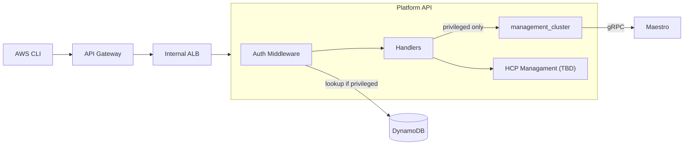

# ROSA Regional Platform API

Stateless gateway API for ROSA HCP regional cluster management.

## Architecture



## Endpoints

| Endpoint                               | Auth       | Description                                  |
| -------------------------------------- | ---------- | -------------------------------------------- |
| `POST /api/v0/management_clusters`     | privileged | Create management cluster (Maestro consumer) |
| `GET /api/v0/management_clusters`      | privileged | List management clusters                     |
| `GET /api/v0/management_clusters/{id}` | privileged | Get management cluster                       |

## Configuration

| Flag                | Default                  | Description     |
| ------------------- | ------------------------ | --------------- |
| `--api-port`        | 8000                     | API server port |
| `--maestro-url`     | `http://maestro:8000`    | Maestro API URL |
| `--dynamodb-table`  | `rosa-customer-accounts` | DynamoDB table  |
| `--dynamodb-region` | `us-east-1`              | AWS region      |

## Build

```bash
make build
make test
make image
```

## API Examples

### Register a new management cluster
```bash
awscurl -X POST https://z11111111.execute-api.us-east-2.amazonaws.com/prod/api/v0/management_clusters \
--service execute-api \
--region us-east-2 \
-H "Content-Type: application/json" \
-d '{"name": "management-01", "labels": {"cluster_type": "management", "cluster_id": "management-01"}}'
```

### Get the current resource bundles
```bash
awscurl https://z11111111.execute-api.us-east-2.amazonaws.com/prod/api/v0/resource_bundles \
--service execute-api \
--region us-east-2
```

### Create a manifestwork for management-01
```bash
# see swagger for reference for the payload struct
awscurl -X POST https://z11111111.execute-api.us-east-2.amazonaws.com/prod/api/v0/work \
--service execute-api \
--region us-east-2 \
-d @payload.json
```


