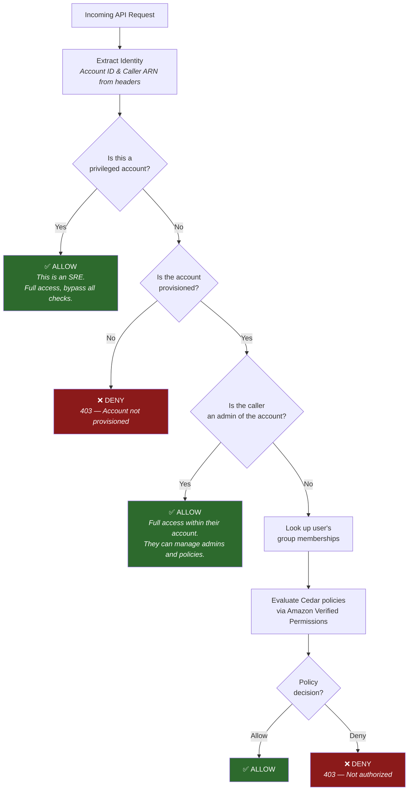

# ROSA Authorization Service

This document describes the Cedar/AVP-based authorization service for the ROSA Regional Frontend API.

## Overview

The authorization service provides fine-grained access control for ROSA operations using:

- **Amazon Verified Permissions (AVP)** for policy evaluation
- **Cedar** as the policy language (policies are written directly in Cedar)
- **DynamoDB** for storing accounts, admins, and groups

The authorization flow is as follows:



Note: full access for SRE is just a temporary state to allow them to manage accounts and policies while the service is in early development. The long-term plan is to migrate SRE access to Cedar policies as well, and remove the privileged bypass.

## Architecture

There are three levels of access:

- **Privileged** — Internal accounts (e.g., SRE) that bypass all authorization (for now). Set via `privileged: true` in the accounts table.
- **Admin** — Account-level administrators who can manage policies, groups, and attachments. Bypass Cedar evaluation for ROSA operations. They are able to grant `admin` to other users. They can only act within their account.
- **Regular user** — All other callers. Access is determined by Cedar policies evaluated through AVP based on the user's group memberships. They can only act within their account.

```text
Request
    |
Identity Middleware (extract accountId, callerArn from headers)
    |
Privileged Check
    |-- Is accountId in DB with privileged=true? -> ALLOW (bypass all)
    +-- Not privileged -> continue
    |
Account Provisioned Check
    |-- Is accountId in DB with privileged=false? -> continue
    +-- Not in DB -> 403 "Account not provisioned"
    |
Admin Check
    |-- Is callerArn an admin for this account? -> ALLOW
    +-- Not admin -> continue
    |
AVP Authorization
    |-- Get user's group memberships from DynamoDB
    |-- Build AVP IsAuthorized request
    |-- Call AVP with policyStoreId from DB
    +-- Return ALLOW/DENY based on AVP decision
    |
Handler
```

## Data Storage

| Entity                                 | Production           | E2E Testing                    |
| -------------------------------------- | -------------------- | ------------------------------ |
| Policy templates                       | AVP                  | MockAVPClient (in-memory)      |
| Attachments (template-linked policies) | AVP                  | MockAVPClient (in-memory)      |
| Policy evaluation                      | AVP IsAuthorized API | cedar-agent (local, port 8181) |
| Accounts                               | DynamoDB             | DynamoDB Local (port 8180)     |
| Admins                                 | DynamoDB             | DynamoDB Local (port 8180)     |
| Groups                                 | DynamoDB             | DynamoDB Local (port 8180)     |
| Group members                          | DynamoDB             | DynamoDB Local (port 8180)     |

Policy templates and attachments live entirely in AVP — they are never stored in DynamoDB. In E2E tests, MockAVPClient resolves `?principal` in templates and syncs the resulting Cedar text to cedar-agent before each authorization check.

## API Endpoints

### Account Management (Privileged Only)

| Method | Path                    | Description                                                          |
| ------ | ----------------------- | -------------------------------------------------------------------- |
| POST   | `/api/v0/accounts`      | Enable an account (creates policy store for non-privileged accounts) |
| GET    | `/api/v0/accounts`      | List all enabled accounts                                            |
| GET    | `/api/v0/accounts/{id}` | Get account details                                                  |
| DELETE | `/api/v0/accounts/{id}` | Disable account (deletes policy store)                               |

### Policy Management (Admin Only)

| Method | Path                          | Description   |
| ------ | ----------------------------- | ------------- |
| POST   | `/api/v0/authz/policies`      | Create policy |
| GET    | `/api/v0/authz/policies`      | List policies |
| GET    | `/api/v0/authz/policies/{id}` | Get policy    |
| PUT    | `/api/v0/authz/policies/{id}` | Update policy |
| DELETE | `/api/v0/authz/policies/{id}` | Delete policy |

### Group Management (Admin Only)

| Method | Path                                | Description          |
| ------ | ----------------------------------- | -------------------- |
| POST   | `/api/v0/authz/groups`              | Create group         |
| GET    | `/api/v0/authz/groups`              | List groups          |
| GET    | `/api/v0/authz/groups/{id}`         | Get group            |
| DELETE | `/api/v0/authz/groups/{id}`         | Delete group         |
| PUT    | `/api/v0/authz/groups/{id}/members` | Update group members |
| GET    | `/api/v0/authz/groups/{id}/members` | List group members   |

### Attachment Management (Admin Only)

| Method | Path                             | Description                 |
| ------ | -------------------------------- | --------------------------- |
| POST   | `/api/v0/authz/attachments`      | Attach policy to user/group |
| GET    | `/api/v0/authz/attachments`      | List attachments            |
| DELETE | `/api/v0/authz/attachments/{id}` | Detach policy               |

### Admin Management (Admin Only)

| Method | Path                         | Description  |
| ------ | ---------------------------- | ------------ |
| POST   | `/api/v0/authz/admins`       | Add admin    |
| GET    | `/api/v0/authz/admins`       | List admins  |
| DELETE | `/api/v0/authz/admins/{arn}` | Remove admin |

> **Note:** There are currently no guards preventing an admin from removing themselves or removing the last admin for an account. If the last admin is removed, the account will have no administrative access and a privileged account will be needed to re-add an admin.

### Authorization Check

| Method | Path                  | Description                                                        |
| ------ | --------------------- | ------------------------------------------------------------------ |
| POST   | `/api/v0/authz/check` | Test whether a principal is authorized for a given action/resource |

> **Note:** All `/api/v0/authz/*` management routes (policies, groups, attachments, admins) are gated by the `RequireAdmin` middleware. Only account-level admins and privileged accounts can access them. The `/api/v0/authz/check` endpoint requires only a provisioned account.

### Cluster and NodePool Management (All Users)

TODO: these endpoints are not implemented yet, but will be added in the future. They will leverage the ROSA Actions documented below.

## Policy Format

Policies are written directly in [Cedar](https://docs.cedarpolicy.com/). The `?principal` placeholder is used as a template variable — when a policy is attached to a user or group, the system resolves `?principal` to the concrete principal entity.

## ROSA Actions Reference

All actions use the `ROSA::Action` entity type in Cedar policies.

- **Cluster**
  - `CreateCluster`, `DeleteCluster`, `DescribeCluster`, `ListClusters`
  - `UpdateCluster`, `UpdateClusterConfig`, `UpdateClusterVersion`
- **NodePool**
  - `CreateNodePool`, `DeleteNodePool`, `DescribeNodePool`, `ListNodePools`
  - `UpdateNodePool`, `ScaleNodePool`
- **Access Entry**
  - `CreateAccessEntry`, `DeleteAccessEntry`, `DescribeAccessEntry`
  - `ListAccessEntries`, `UpdateAccessEntry`
- **Tagging**
  - `TagResource`, `UntagResource`, `ListTagsForResource`
- **Other**
  - `ListAccessPolicies`

### Differences from AWS IAM Action Matching

AWS IAM supports wildcard matching on action strings (e.g., `rosa:Describe*`, `s3:Get*`, `ec2:*`), which allows selecting groups of actions by prefix without listing them individually. **Cedar does not support action wildcards.** The available alternatives are:

- **Unconstrained `action`** — Matches all actions. Equivalent to `"Action": "*"` in IAM. Use this when a policy applies to every action (with conditions in `when`/`unless` clauses to narrow scope).
  ```cedar
  permit(?principal, action, resource)
  when { resource.tags["Environment"] == "development" };
  ```
- **Explicit action lists** — Required for any subset of actions. There is no way to write the Cedar equivalent of `rosa:Describe*` without listing each Describe action individually.
  ```cedar
  permit(?principal,
    action in [ROSA::Action::"DescribeCluster", ROSA::Action::"DescribeNodePool",
               ROSA::Action::"DescribeAccessEntry"],
    resource);
  ```
- **Action groups (future)** — Cedar schemas support action hierarchies (`action CreateCluster in [AllActions]`), which would allow `action in ROSA::Action::"ReadOnly"` style grouping. This requires schema changes and is not currently implemented.

## Cedar Schema

The ROSA Cedar schema defines the following entity types:

- **`ROSA::Principal`** — Users identified by ARN
- **`ROSA::Group`** — Groups that principals can be members of (parents of Principal)
- **`ROSA::Resource`** — Base resource type with `tags: Map<String, String>`
- **`ROSA::Cluster`** — Inherits from Resource
- **`ROSA::NodePool`** — Inherits from Resource
- **`ROSA::AccessEntry`** — Inherits from Resource

The full schema is at `pkg/authz/schema/rosa.cedarschema`.

## Context Attributes

TODO: context attributes will need to be designed and implemented. For now some examples have been provided in the policies at `pkg/authz/testdata/policies/` for reference: `mfaPresent`, `principalArn`, `principalTags`, `tagKeys`, `requestTags`, `accessScope`, `namespaces`, `kubernetesGroups`, `policyArn`, and `username`.

## Running Tests

```bash
# Run all authz package tests
make test-authz

# Run E2E authz tests (requires podman-compose with cedar-agent + DynamoDB Local)
make test-e2e-authz

# Run all tests
make test
```

## Example: Setting Up Authorization

```bash
# 1. Enable an account (as privileged account)
curl -X POST /api/v0/accounts \
  -H "X-Amz-Account-Id: 111122223333" \
  -d '{"accountId": "777788889999", "privileged": false}'

# 2. Add an admin for the account
curl -X POST /api/v0/authz/admins \
  -H "X-Amz-Account-Id: 777788889999" \
  -d '{"principalArn": "arn:aws:iam::777788889999:user/admin"}'

# 3. Create a Cedar policy
curl -X POST /api/v0/authz/policies \
  -H "X-Amz-Account-Id: 777788889999" \
  -d '{
    "name": "DevClusterAccess",
    "description": "Full access to development clusters",
    "policy": "permit(\n  ?principal,\n  action,\n  resource\n)\nwhen { resource.tags[\"Environment\"] == \"development\" };"
  }'

# 4. Create a group
curl -X POST /api/v0/authz/groups \
  -H "X-Amz-Account-Id: 777788889999" \
  -d '{"name": "developers", "description": "Developer team"}'

# 5. Add members to the group
curl -X PUT /api/v0/authz/groups/{groupId}/members \
  -H "X-Amz-Account-Id: 777788889999" \
  -d '{"add": ["arn:aws:iam::777788889999:user/alice"]}'

# 6. Attach the policy to the group
curl -X POST /api/v0/authz/attachments \
  -H "X-Amz-Account-Id: 777788889999" \
  -d '{
    "policyId": "{policyId}",
    "targetType": "group",
    "targetId": "{groupId}"
  }'
```

## Further Reading

- [Cedar Language Reference](https://docs.cedarpolicy.com/)
- [Amazon Verified Permissions Documentation](https://docs.aws.amazon.com/verifiedpermissions/)
